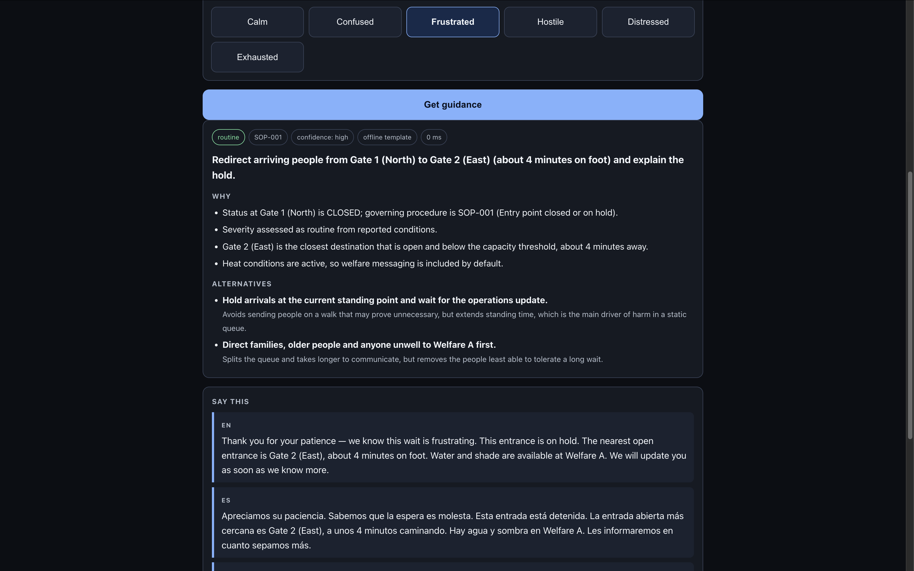

# Frontline Voice

**Crowd de-escalation copilot for last-mile volunteers — FIFA World Cup 2026**

Turn a raw operations alert into calm, credible, correctly-worded action in under five seconds.

**[▶ Live app](https://frontline-voice-751909779915.asia-south1.run.app)** · **[Source](https://github.com/reply2vikas/frontline-voice)**

Runs with no API key required — the deterministic engine answers when no credentials are configured, so you can evaluate the whole product immediately.



---

## Contents

- [The problem](#the-problem)
- [What makes it different](#what-makes-it-different)
- [The volunteer authority boundary](#the-volunteer-authority-boundary)
- [Architecture](#architecture)
- [Module guide](#module-guide)
- [The precedent corpus](#the-precedent-corpus)
- [Register is a safety control](#register-is-a-safety-control)
- [Safety model](#safety-model)
- [Accessibility](#accessibility)
- [Testing strategy](#testing-strategy)
- [Run it](#run-it)
- [Deploy](#deploy)
- [Evaluator harness](#evaluator-harness)
- [API reference](#api-reference)
- [Engineering notes and tradeoffs](#engineering-notes-and-tradeoffs)
- [Known limits](#known-limits)
- [Future work](#future-work)

---

## The problem

At the 2024 Copa América final at Hard Rock Stadium — the same venue hosting 2026 matches — unticketed
crowds breached the gates, closing the gates created a crush, and the match was delayed by over an hour.
The police after-action report recommended that the venue **make better use of exterior speakers to
communicate with large crowds**.

That missing communication layer is a person: an 18-year-old volunteer, three days of training, often not
a fluent local-language speaker, standing in front of four thousand people with no idea what to say.

**Before** — the volunteer receives a terse ops broadcast (`GATE_B CLOSED, hold 30min`) and has to
improvise wording, in a language they may not speak, to a crowd that is already angry.

**After** — the copilot resolves the facts deterministically, retrieves what happened the last time this
situation occurred at a real tournament, and hands the volunteer an explainable recommendation plus a
ready-to-read script in English, Spanish and French.

### Why the volunteer, and not the fan

The challenge names four personas: fans, organizers, volunteers, venue staff. Fan-facing tools are the
crowded choice — wayfinding apps and chatbots. The volunteer is the persona with the least support and the
most leverage: they are the last human contact before a crowd makes a decision, and they are the layer that
after-action reports repeatedly identify as under-informed.

---

## What makes it different

**It cites real incidents.** Every recommendation is grounded in a corpus of 12 documented precedents drawn
from official after-action reviews and attribution studies — Copa América 2024, the 2022 Champions League
final at the Stade de France, Euro 2024 in Gelsenkirchen, and the 2026 heat analyses. Each citation carries
an `evidence_tier` so the interface can distinguish a formal inquiry finding from press reporting rather
than implying they carry equal weight.

**It cannot hallucinate a gate.** The deterministic core resolves every fact and passes the model a *closed
set* of legal zone IDs. The model may only reference IDs from that set; a safety guard strips anything else
and falls back to the template engine. This is enforced structurally, not by prompt instruction.

**It knows what a volunteer may not do.** Volunteers have no authority to open gates, direct police, order
evacuations or move people past a security line. Prohibited-action patterns are matched against every
generated response and rejected.

**It runs with no credentials.** With no API key the entire product works through the deterministic template
engine. A credential failure degrades wording quality, never availability.

**It shows its uncertainty.** Every response carries a confidence level and two or three alternatives with
their tradeoffs, rather than a single answer presented as certain.

---

## The volunteer authority boundary

This constraint shaped every design decision and is enforced in code, not just documentation.

```
A VOLUNTEER CANNOT   lock/unlock gates - direct police - order evacuations -
                     add transit capacity - countermand security - disperse crowds

A VOLUNTEER CAN      reduce information asymmetry - micro-redirect ARRIVING people -
                     report ground truth upward - explain and reassure -
                     guide to accessible, quiet, medical, water or cooling points
```

The tool is an **information cushion**, never a dispatch system. `SOP-012` handles requests that exceed
volunteer authority by saying so plainly, escalating, and offering what *is* in scope. The safety guard in
`app/safety.py` rejects any generated text matching an out-of-authority action, and `tests/test_safety.py`
proves it.

---

## Architecture

```
Ops feed JSON  +  Volunteer 3-tap input (location - issue - crowd mood)
        |
        v
 DETERMINISTIC CORE - typed, tested, no model involved
   validates feed - resolves open gates, step-free routes, welfare and medical points
   computes severity and escalation thresholds - selects governing SOP - picks register
   emits a CLOSED SET of legal zone IDs
        |
        v
 RETRIEVAL - transparent additive scoring over 12 curated precedents
        |
        v
 GENERATION - schema-locked; may only phrase. Returns recommendation, rationale,
   confidence, alternatives-with-tradeoffs, and EN/ES/FR scripts
        |
        v
 SAFETY GUARD - illegal zone refs and prohibited actions rejected -> template fallback
        |
        v
 AUDIT LOG + OPERATIONAL LOG - every decision reconstructable, every degradation explained
```

The model can degrade the *wording* of an announcement. It can never change which gate a volunteer sends
four thousand people toward.

---

## Module guide

Thirteen modules, each with a single responsibility.

| Module | Lines | Responsibility |
| --- | ---: | --- |
| `app/engine.py` | 256 | The deterministic core. Resolves status, computes legal destinations, grades severity, decides escalation, selects register and SOP. Built from small single-purpose resolvers (`_resolve_status`, `_heat_is_active`, `_escalation_reasons`, `_grade_severity`, `_select_register`, `_allowed_zone_ids`) composed by `decide`. |
| `app/main.py` | 209 | FastAPI application, routes, security headers, static mounting. Deliberately thin: business logic lives in `engine` and `llm`. |
| `app/templates.py` | 198 | The offline engine. Builds a complete response — recommendation, rationale, alternatives, EN/ES/FR announcements — from resolved facts alone, with no model involved. |
| `app/llm.py` | 188 | Schema-locked generation layer. Builds the XML-delimited prompt, calls the API, parses strictly, runs the guard, and degrades to templates on any failure. |
| `app/schemas.py` | 155 | Typed contracts between layers. `GenAIOutput` is the only shape the model may return. |
| `app/simulator.py` | 138 | Deterministic operations-feed simulator. The same seed and minute always produce identical state. |
| `app/venues.py` | 129 | Venue topology for three host stadiums. The authoritative, immutable zone set. |
| `app/safety.py` | 118 | Hallucination and authority guards, plus prompt-injection sanitisation. |
| `app/corpus.py` | 101 | Corpus loading and precedent retrieval by transparent additive scoring. |
| `app/audit.py` | 95 | Append-only decision log in SQLite. Schema applies idempotently on connect. |
| `app/config.py` | 51 | Settings and named retrieval weights. Every credential is optional by design. |
| `app/logging_setup.py` | 38 | Structured operational logging, namespaced under `frontline`. |

### Repository layout

```
backend/
  app/          application modules (above)
  data/         precedent_corpus.json - sop_corpus.json - the grounding corpus
  static/       index.html - app.css - app.js - favicon.svg - the interface
  tests/        96 tests across 8 files
  Dockerfile    Cloud Run image, non-root, /tmp database
  pyproject.toml  ruff, mypy, pytest configuration and coverage gate
docs/           README screenshots
.github/workflows/ci.yml   lint - types - dependency audit - tests
```

---

## The precedent corpus

`data/precedent_corpus.json` holds 12 documented incidents; `data/sop_corpus.json` holds 12 volunteer
procedures, each traced to the precedents that justify it.

**Sources by event**

| Event | Venue | Entries |
| --- | --- | ---: |
| CONMEBOL Copa América 2024 Final | Hard Rock Stadium, Miami Gardens | 4 |
| UEFA Champions League Final 2022 | Stade de France, Saint-Denis | 3 |
| UEFA Euro 2024 (Serbia v England) | Arena AufSchalke, Gelsenkirchen | 3 |
| FIFA World Cup 2026 heat analyses | 16 host cities | 2 |

**Evidence tiers** — 8 entries are `official_report` (published inquiry, government report, or attribution
study); 4 are `credible_reporting` (established news organisations, no formal inquiry). The interface
displays the tier beside every citation so a formal finding is never presented as equal to press coverage.

**Curation method.** Every entry was written by hand from the cited public reporting, in original wording,
and carries source URLs. Qatar 2022 and Paris 2024 were deliberately excluded because specific documented
findings could not be verified — a model asked to cite incidents will invent them, so nothing here is
generated.

**Structure.** Each precedent records what happened, the root cause, the official finding, its relevance to
a volunteer, an explicit authority-boundary note, its link to a 2026 venue, and retrieval triggers (status,
crowd mood, tournament phase). Each SOP records permitted actions, prohibitions, escalation conditions,
announcement intent and default register.

**Retrieval.** `corpus.retrieve` scores every precedent against the situation using named weights in
`config.RetrievalWeights`: status match 3.0, mood 2.0, phase 1.0, free-text overlap up to 1.5, plus a 0.5
evidence bonus applied *only* when the entry is already relevant. That last condition matters — applying it
unconditionally caused official reports to surface on queries they had no bearing on, which would have cited
a crush report during a routine situation. `tests/test_corpus.py` pins a 12-case hit-rate gate.

---

## Register is a safety control

Naive translation is a hazard in a compressed crowd, not merely impolite.

| Situation | Escalates | De-escalates |
| --- | --- | --- |
| Spanish, frustrated crowd | `Cálmense` — heard as patronising | `Apreciamos su paciencia, estamos trabajando para abrir el acceso` |
| Spanish, movement needed | `Retroceda` — a bare order | `Demos un paso atrás` — collective, shared |
| French, any crowd | tutoiement | vouvoiement throughout |

Four register modes are selected deterministically from crowd mood and the governing SOP:

- **informational** — calm crowd. Fact, reason, next step.
- **de-escalating** — frustrated or hostile. Acknowledge first, avoid blame and commands, then one action.
- **welfare** — exhausted, distressed, or heat-affected. Lead with water, shade, seating. Short sentences.
- **urgent_clear** — one instruction, one destination, explanation afterwards.

Transport vocabulary is never translated literally, because the local term for a shuttle differs by region.
These rules live in `data/sop_corpus.json` and are enforced in both the template and generation paths.

---

## Safety model

**Closed-set enforcement.** The deterministic core emits `allowed_zone_ids`. `safety.find_illegal_zone_refs`
scans every field of the generated output for zone-shaped identifiers and rejects any that are not in that
set. A hallucinated `GATE_99` cannot reach a volunteer.

**Authority patterns.** Seven regular expressions detect out-of-scope instructions: directing people past a
security line, commanding gate operations, ordering evacuation, sending people toward a closed entry,
patronising calm-down commands, blaming the crowd, and making medical judgements. One pattern needed
tightening during development — "the nearest **open entrance**" was initially misread as an instruction to
open a gate, so it now requires a determiner. `tests/test_safety.py` pins both behaviours.

**Prompt injection.** Volunteer free text is wrapped in an `<untrusted_text>` element, never concatenated
into instructions, and six known override patterns are redacted before the prompt is assembled.

**Degradation is explicit.** A missing key logs at DEBUG (it is a supported mode), a transport failure logs
at WARNING with a stack trace, and a guard rejection logs at ERROR with the specific violation. No failure
is silent, and `tests/test_logging.py` asserts that credentials never appear in log output.

**Transport hardening.** Security headers on every response (`X-Content-Type-Options`, `X-Frame-Options`,
`Referrer-Policy`, a strict `Content-Security-Policy`, `Permissions-Policy`), dependencies pinned and
audited with `pip-audit`, and secrets read only from the environment.

---

## Accessibility

Targeted at **WCAG 2.1 AAA**, and enforced in CI rather than asserted.

`tests/test_a11y.py` computes contrast ratios directly from `static/app.css` and fails the build below 7:1
on every foreground and background combination. It caught a red at 6.98:1 during development.

Also gated: a skip link as the first focusable element, a declared document language, the full ARIA tab
pattern with arrow-key navigation, labelled form controls, visible focus rings, 44px minimum touch targets,
live regions for asynchronous updates, a text-equivalent table for the SVG map, and `prefers-reduced-motion`
support.

The interface itself is designed for the operating conditions: a volunteer in a crowd cannot type, so the
input is three taps — location, issue, crowd mood.

---

## Testing strategy

96 tests across 8 files, 95% coverage, with a 90% gate in `pyproject.toml`.

| File | Tests | Covers |
| --- | ---: | --- |
| `test_api.py` | 19 | Endpoint contracts, offline parity, upload harness, CSP compatibility |
| `test_engine.py` | 14 | Destination filtering, capacity thresholds, escalation, register selection |
| `test_a11y.py` | 13 | Computed contrast ratios, ARIA structure, keyboard navigation |
| `test_corpus.py` | 12 | Corpus integrity, source URLs, evidence tiers, retrieval hit-rate gate |
| `test_llm.py` | 12 | Parsing, guard enforcement, every degradation path — no network calls |
| `test_simulator.py` | 11 | Determinism, bounds, schema validity |
| `test_safety.py` | 8 | Hallucinated zones, authority violations, injection redaction |
| `test_logging.py` | 7 | Degradation causes recorded, credentials never logged |

The tests that matter most are not the happy paths: hallucinated-zone rejection, authority-boundary
violation, injection redaction, retrieval hit-rate, and offline parity. Edge cases are covered explicitly —
unknown venues, empty feeds, all gates closed, over-capacity zones, malformed model responses.

---

## Run it

```bash
cd backend
python3.12 -m venv .venv && source .venv/bin/activate
pip install -r requirements-dev.txt
uvicorn app.main:app --reload
# open http://127.0.0.1:8000
```

No API key needed. To enable model-phrased output, copy `.env.example` to `.env` and set
`ANTHROPIC_API_KEY`.

```bash
pytest                       # 96 tests, 95% coverage, gate at 90%
ruff check . && ruff format --check .
mypy app
pip-audit -r requirements.txt
```

---

## Deploy

Live on Google Cloud Run at
https://frontline-voice-751909779915.asia-south1.run.app

```bash
cd backend
gcloud run deploy frontline-voice --source . --region asia-south1 --allow-unauthenticated
```

The container runs as a non-root user and writes its audit database to `/tmp`, so a cold, ephemeral
filesystem is handled correctly.

---

## Evaluator harness

`POST /api/upload/feed` accepts your own operations feed and reports what the deterministic core makes of
it, including which zones it rejects as unknown — with no credentials required.

```bash
curl -X POST http://127.0.0.1:8000/api/upload/feed -H 'Content-Type: application/json' \
  -d '[{"zone_id":"GATE_1","status":"OPEN"},{"zone_id":"GATE_3","status":"CLOSED"}]'
```

---

## API reference

| Endpoint | Purpose |
| --- | --- |
| `GET /api/health` | Status and which engine will answer |
| `GET /api/venues` | Venue topology (Miami, Mexico City, New York New Jersey) |
| `POST /api/decide` | The decision loop |
| `GET /api/venue-state/{id}` | Simulated live state for the map and telemetry |
| `GET /api/venue-feed/{id}` | The same state expressed as ops-feed events |
| `POST /api/upload/feed` | Evaluator data harness |
| `GET /api/audit` | Decision audit log |

---

## Engineering notes and tradeoffs

**No vector store.** The corpus is 12 precedents. Exhaustive transparent scoring is exact and O(n) at this
size, whereas an embedding index would add roughly 500 MB of dependencies, install fragility and repository
weight to approximate what direct scoring computes precisely. A retrieval hit-rate test gates the scoring so
a regression fails the build rather than silently citing the wrong precedent.

**Static frontend, no build step.** Semantic HTML with ARIA live regions, served directly by FastAPI. This
removes an entire class of build failure and keeps the repository small. The tradeoff is no component
framework; at this surface area that is a net gain.

**SQLite for the audit log.** Marginal for a demo, but accountability is a genuine requirement for an
operations tool, and the schema applies idempotently on connect so a cold container serves correctly.

**Simulated feed, deterministically.** State derives from a seed and a time bucket rather than randomly, so
the map, telemetry and test suite always agree and any screenshot is reproducible.

**Complexity kept low deliberately.** Maximum cyclomatic complexity is 8 and average function length 7.7
lines. The orchestration function was originally 87 lines at complexity 33; it is now a composition of small
named resolvers, which is the form that can actually be read and changed safely.

---

## Known limits

- The operations feed is simulated. Volunteers do not have CCTV or crowd-density sensors, so the product is
  designed for the terse command-centre broadcast they *do* receive.
- Accessibility routing is limited to pre-mapped step-free, sensory and medical points rather than live
  geospatial routing, which cannot be faked responsibly.
- Three venues are modelled, not all sixteen host stadiums.
- Qatar 2022 and Paris 2024 are absent from the corpus because specific findings could not be verified.

---

## Future work

- **Two-way speech.** Transcribe a fan speaking an unknown language, classify intent and urgency, and
  respond in the correct register — the natural extension of the current one-way script generation.
- **Real ops-feed adapters.** The upload harness already accepts external data; production adapters for a
  venue command system would replace the simulator without touching the core.
- **Upward reporting loop.** `SOP-010` defines what a volunteer should report; wiring those reports back to
  a command dashboard would close the intelligence gap identified in the Copa América after-action review.
- **Corpus expansion with verification.** Add Qatar 2022, Paris 2024 and Euro 2020 once primary documents
  can be cited directly, keeping the evidence-tier discipline.
- **Per-venue register tuning.** Mexican and Argentine Spanish differ in exactly the ways that matter for
  de-escalation; the register policy is structured to hold locale variants.
- **Offline-first packaging.** A service worker would let the deterministic engine keep working on a phone
  with no signal inside a crowded concourse.
