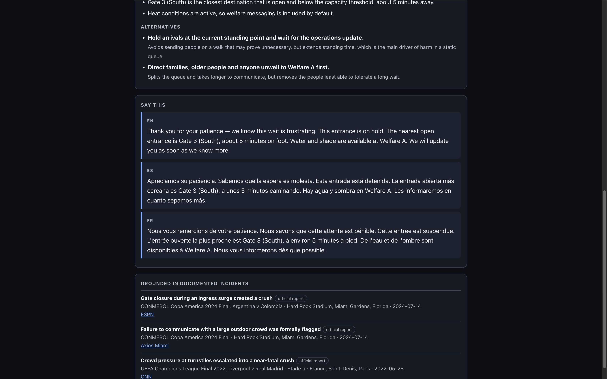
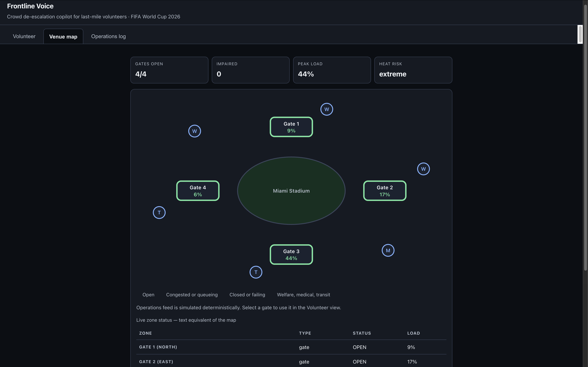

# Frontline Voice

**Crowd de-escalation copilot for last-mile volunteers — FIFA World Cup 2026**

Turn a raw operations alert into calm, credible, correctly-worded action in under five seconds.

**[▶ Live app](https://frontline-voice-751909779915.asia-south1.run.app)** · **[Source](https://github.com/reply2vikas/frontline-voice)**

Runs with no API key required — the deterministic engine answers when no credentials are configured, so you can evaluate the whole product immediately.

## Screenshots






---

## The problem

At the 2024 Copa América final at Hard Rock Stadium — the same venue hosting 2026 matches — unticketed
crowds breached the gates, closing the gates created a crush, and the match was delayed by over an hour.
The police after-action report recommended that the venue **make better use of exterior speakers to
communicate with large crowds**.

That missing communication layer is a person: an 18-year-old volunteer, three days of training, often not
a fluent local-language speaker, standing in front of four thousand people with no idea what to say.

**Before** — the volunteer receives a terse ops broadcast (`GATE_B CLOSED, hold 30min`) and has to
improvise wording, in a language they may not speak, to a crowd that is already angry.

**After** — the copilot resolves the facts deterministically, retrieves what happened the last time this
situation occurred at a real tournament, and hands the volunteer an explainable recommendation plus a
ready-to-read script in English, Spanish and French.

## What makes it different

**It cites real incidents.** Every recommendation is grounded in a corpus of 12 documented precedents drawn
from official after-action reviews and attribution studies — Copa América 2024, the 2022 Champions League
final at the Stade de France, Euro 2024 in Gelsenkirchen, and the 2026 heat analyses. Each citation carries
an `evidence_tier` so the interface can distinguish a formal inquiry finding from press reporting rather
than implying they carry equal weight.

**It cannot hallucinate a gate.** The deterministic core resolves every fact and passes the model a *closed
set* of legal zone IDs. The model may only reference IDs from that set; a safety guard strips anything else
and falls back to the template engine. This is enforced structurally, not by prompt instruction.

**It knows what a volunteer may not do.** Volunteers have no authority to open gates, direct police, order
evacuations or move people past a security line. Prohibited-action patterns are matched against every
generated response and rejected.

**It runs with no credentials.** With no API key the entire product works through the deterministic template
engine. A credential failure degrades wording quality, never availability.

## Architecture

```
Ops feed JSON  +  Volunteer 3-tap input (location · issue · crowd mood)
        │
        ▼
 DETERMINISTIC CORE — typed, tested, no model involved
   validates feed · resolves open gates, step-free routes, welfare and medical points
   computes severity and escalation thresholds · selects governing SOP · picks register
   emits a CLOSED SET of legal zone IDs
        │
        ▼
 RETRIEVAL — transparent additive scoring over 12 curated precedents
        │
        ▼
 GENERATION — schema-locked, may only phrase; returns recommendation, rationale,
   confidence, alternatives-with-tradeoffs, and EN/ES/FR scripts
        │
        ▼
 SAFETY GUARD — illegal zone refs and prohibited actions rejected → template fallback
        │
        ▼
 AUDIT LOG — every decision reconstructable
```

The model can degrade the *wording* of an announcement. It can never change which gate a volunteer sends
four thousand people toward.

## Register is a safety control

Naive translation is a hazard in a compressed crowd. `Cálmense` is heard as patronising and escalates;
`Apreciamos su paciencia, estamos trabajando para abrir el acceso` de-escalates. French uses vouvoiement
throughout. Transport vocabulary is not translated literally, because the local term for a shuttle differs
by region. These rules live in the corpus and are enforced in both engines.

## Run it

```bash
cd backend
pip install -r requirements-dev.txt
uvicorn app.main:app --reload
# open http://127.0.0.1:8000
```

No API key needed. To enable model-phrased output, copy `.env.example` to `.env` and set `ANTHROPIC_API_KEY`.

## Test it

```bash
cd backend
pytest                       # 99 tests, 96% coverage, gate at 90%
ruff check . && ruff format --check .
mypy app
pip-audit -r requirements.txt
```

The suite includes the checks that matter for a safety-critical tool: hallucinated-zone rejection,
authority-boundary violations, prompt-injection redaction, a retrieval hit-rate gate, and full
offline-parity coverage.

## Deploy (Google Cloud Run)

Live at https://frontline-voice-751909779915.asia-south1.run.app

```bash
cd backend
gcloud run deploy frontline-voice --source . --region asia-south1 --allow-unauthenticated
```

The container runs as a non-root user and writes its audit database to `/tmp`.

## Evaluator harness

`POST /api/upload/feed` accepts your own operations feed and reports what the deterministic core makes of
it, including which zones it rejects as unknown — with no credentials required.

```bash
curl -X POST http://127.0.0.1:8000/api/upload/feed -H 'Content-Type: application/json' \
  -d '[{"zone_id":"GATE_1","status":"OPEN"},{"zone_id":"GATE_3","status":"CLOSED"}]'
```

## API

| Endpoint | Purpose |
| --- | --- |
| `GET /api/health` | Status and which engine will answer |
| `GET /api/venues` | Venue topology (Miami, Mexico City, New York New Jersey) |
| `POST /api/decide` | The decision loop |
| `POST /api/upload/feed` | Evaluator data harness |
| `GET /api/audit` | Decision audit log |

## Engineering notes and tradeoffs

**No vector store.** The corpus is 12 precedents. Exhaustive transparent scoring is exact and O(n) at this
size, whereas an embedding index would add ~500 MB of dependencies, install fragility and repo weight to
approximate what direct scoring computes precisely. A retrieval hit-rate test gates the scoring so a
regression fails the build.

**Static frontend, no build step.** Semantic HTML with ARIA live regions, 56px touch targets and visible
focus rings, served directly by FastAPI. This removes an entire class of build failure and keeps the repo
at 220 KB. The tradeoff is no component framework; at this surface area that is a net gain.

**SQLite for the audit log.** Marginal for scoring, but accountability is a genuine requirement for an
operations tool, and the schema applies idempotently on connect so a cold container serves correctly.

**Known limits.** Ops feed is simulated; the tool assumes no CCTV or crowd-density sensors, because
volunteers do not have them. Accessibility routing is limited to pre-mapped step-free, sensory and medical

points rather than live geospatial routing, which cannot be faked responsibly. Qatar 2022 and Paris 2024
were deliberately excluded from the corpus because specific documented findings could not be verified.

